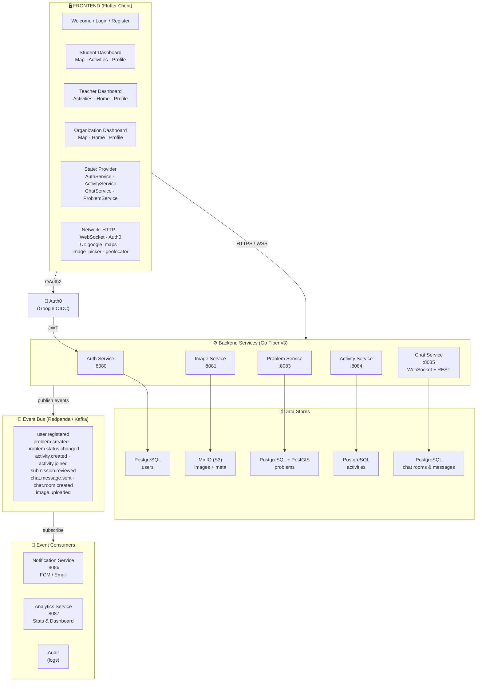
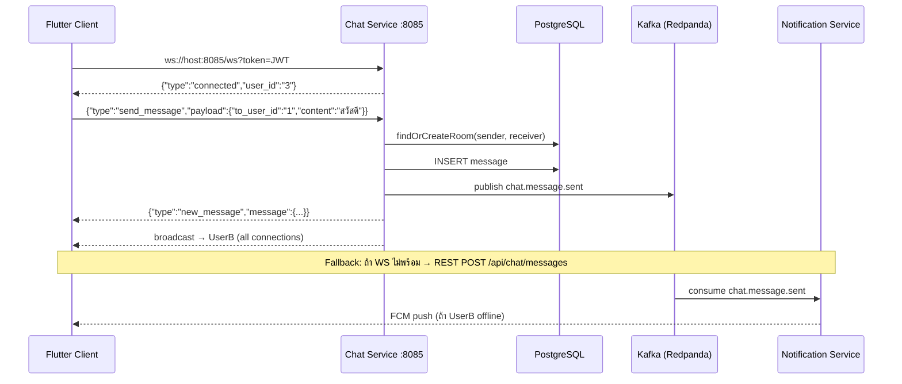
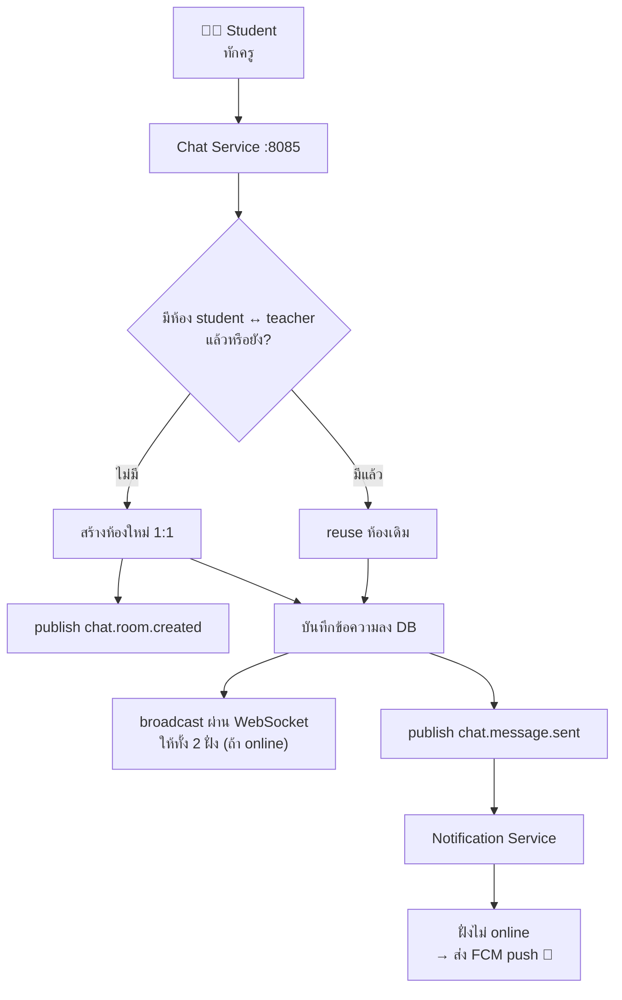
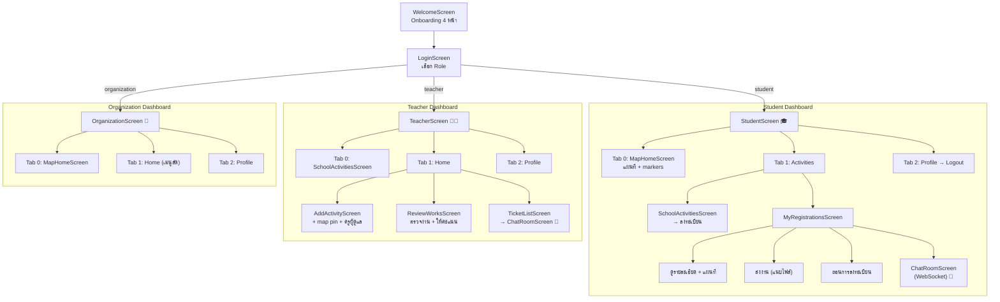

# Socialdev App

## High-Level Architecture (Microservices + Event-Driven)

ระบบออกแบบเป็น **microservices** แยกตาม domain และสื่อสารกันแบบ async ผ่าน **Event Bus (Kafka / Redpanda)** สำหรับงานที่ไม่ต้องรอผลลัพธ์ทันที เช่น การแจ้งเตือน, การสร้างห้องแชทอัตโนมัติ และ analytics ระบบแชทใช้ **WebSocket** สำหรับ real-time messaging



### Services (Domain Boundaries)

| Service | Port | Responsibility | Data Store |
|---------|------|----------------|------------|
| **Auth Service** | 8080 | Register / Login / Google OAuth / JWT / Profile | Postgres |
| **Image Service** | 8081 | Upload / Presign รูปทุกประเภท | MinIO + Postgres |
| **Problem Service** | 8083 | CRUD ปัญหาชุมชน + PostGIS query | Postgres + PostGIS |
| **Activity Service** | 8084 | กิจกรรมโรงเรียน, ลงทะเบียน, ถอนลงทะเบียน, ส่งงาน, ตรวจงาน, ครูผู้ดูแล | Postgres |
| **Chat Service** | 8085 | WebSocket real-time + REST fallback, ห้องแชท auto-create, ส่งรูปในแชท | Postgres |
| **Notification** | 8086 | Push (FCM), Email — consume events | - |
| **Analytics** | 8087 | สรุปสถิติ, dashboard — consume events | Postgres |

### Event Topics

| Topic | Producer | Consumers |
|-------|----------|-----------|
| `user.registered` | Auth | Notification, Analytics |
| `problem.created` | Problem | Notification, Analytics |
| `problem.status.changed` | Problem | Notification (เจ้าของปัญหา) |
| `activity.created` | Activity | Notification (broadcast นักเรียน) |
| `activity.joined` | Activity | Notification (แจ้งครู) |
| `submission.reviewed` | Activity | Notification, Chat (ส่ง feedback อัตโนมัติ) |
| `chat.message.sent` | Chat | Notification (push offline user) |
| `image.uploaded` | Image | Problem / Activity (link metadata) |

### WebSocket Chat Flow



**Fallback:** ถ้า WebSocket ยังไม่ connected จะ fallback ใช้ REST API `POST /api/chat/messages` แทน แล้ว broadcast ผ่าน WebSocket Hub ให้อีกฝั่ง

### Auto-Create Chat Room (นักเรียนทักครู)



### Communication Patterns

| รูปแบบ | ใช้เมื่อ | ตัวอย่าง |
|--------|---------|---------|
| **Sync (REST)** | ต้องการผลลัพธ์ทันที | Client → Service (CRUD) |
| **Async (Event Bus)** | งานที่ไม่ต้องรอ มี consumer หลายตัว | Notification, Analytics |
| **WebSocket** | Real-time bi-directional | Chat Service (send + receive messages) |

### Implementation Status

| Component | Status | Notes |
|-----------|--------|-------|
| Auth Service `:8080` | ✅ | publishes `user.registered` |
| Image Service `:8081` | ✅ | MinIO backend, presigned URLs |
| Problem Service `:8083` | ✅ | publishes `problem.created`, `problem.status.changed` |
| Activity Service `:8084` | ✅ | CRUD + register/unregister + submit + review + supervisor + map location |
| Chat Service `:8085` | ✅ | **WebSocket real-time** + REST fallback + image messages |
| Notification Service `:8086` | ✅ | consumes events, log-based (FCM/SMTP pending) |
| Analytics Service `:8087` | ✅ | consumes all events → Postgres `event_log` + `event_counts`, `GET /stats` |
| Event Bus | ✅ | Redpanda (Kafka API) via `segmentio/kafka-go` |

---

## Tech Stack Summary

```
Frontend:  Flutter + Provider + Google Maps + Auth0 + WebSocket
Backend:   Go Fiber v3 + GORM + JWT + bcrypt + fasthttp/websocket
Database:  PostgreSQL + PostGIS + uuid-ossp
Storage:   MinIO (S3-compatible)
Events:    Redpanda (Kafka API)
Auth:      Auth0 (Google OAuth2) + Local (email/password)
```

---

## Project Structure

### Entry Point

```
main.dart
  └─ CommunityReportApp (Provider wrapper: AuthService, ActivityService, ChatService, ProblemService)
     └─ AuthGate (ตรวจสอบสถานะ login)
        ├─ ยังไม่ login → WelcomeScreen
        └─ login แล้ว → HomeScreen (ตาม role)
```

---

## Screens

| ไฟล์ | Widget | หน้าที่ |
|------|--------|---------|
| `welcome_screen.dart` | `WelcomeScreen` | Onboarding carousel 4 หน้า |
| `login_screen.dart` | `LoginScreen` | เลือก role + ฟอร์ม login + Login with Google |
| `register_screen.dart` | `RegisterScreen` | สมัครสมาชิก |
| `map_screen.dart` | `MapHomeScreen` | Google Maps + custom markers ปัญหาชุมชน |
| `problem_detail_screen.dart` | `ProblemDetailScreen` | รายละเอียดปัญหา |
| `student/student_screen.dart` | `StudentScreen` | Dashboard นักเรียน + Bottom Navigation |
| `student/school_activities_screen.dart` | `SchoolActivitiesScreen` | รายการกิจกรรมโรงเรียน + ลงทะเบียน |
| `student/my_registrations_screen.dart` | `MyRegistrationsScreen` | กิจกรรมที่ลงทะเบียน (API จริง) + ถอนการลงทะเบียน + แผนที่สถานที่ + ส่งงาน + แชทกับครู |
| `student/chat_screen.dart` | `TicketListScreen` / `ChatRoomScreen` | ระบบแชท **WebSocket real-time** + ส่งรูปภาพ + REST fallback |
| `teacher/teacher_screen.dart` | `TeacherScreen` | Dashboard ครู + Bottom Navigation |
| `teacher/add_activity_screen.dart` | `AddActivityScreen` | ฟอร์มเพิ่มกิจกรรม + ปักหมุดแผนที่ + ครูผู้ดูแล + เบอร์ติดต่อ |
| `teacher/review_works_screen.dart` | `ReviewWorksScreen` | ตรวจงานนักเรียน (API จริง) — ดูกิจกรรมที่สร้าง, submissions, ให้คะแนน ผ่าน/ไม่ผ่าน |
| `organization/organization_screen.dart` | `OrganizationScreen` | Dashboard หน่วยงาน |

---

## Models

**`models/problem_report.dart`**
- `ProblemReport` - ข้อมูลปัญหา (id, title, description, location, status, imageUrls)
- `ProblemCategory` enum: flood, trash, traffic, infrastructure, other
- `ProblemStatus` enum: pending, inProgress, resolved
- `ProblemSource` enum: user, government, urgent

**`models/activity.dart`**
- `Activity` - ข้อมูลกิจกรรม (id, teacherId, title, description, location, **latitude, longitude, supervisor, supervisorPhone**, startAt, endAt, maxSlots, imageIds)
- `Registration` - ข้อมูลการลงทะเบียน + nested `Activity`
- `Submission` - ข้อมูลการส่งงาน (id, content, imageIds, score, feedback, status, **studentId, activityId**)

**`models/chat.dart`**
- `ChatRoom` - ห้องแชท (id, userA, userB)
- `ChatMessage` - ข้อความแชท (id, roomId, senderId, content, **imageId**, readAt)

---

## Services

**`services/api_config.dart`**
- `ApiConfig` - base URL ของแต่ละ service (auto-detect Android/iOS)

**`services/auth_service.dart`**
- `AuthService` (ChangeNotifier) - login/logout, JWT management
- `login()`, `register()`, `loginWithGoogle()`
- Properties: isLoggedIn, username, role, token, userId, avatarUrl, authHeaders

**`services/problem_service.dart`**
- `ProblemService` (ChangeNotifier) - CRUD ปัญหาชุมชน
- `fetchProblems()`, `createProblem()`, `updateProblemStatus()`

**`services/activity_service.dart`**
- `ActivityService` (ChangeNotifier) - จัดการกิจกรรม
- `fetchActivities()`, `createActivity()` (+ supervisor, location pin)
- `registerForActivity()`, `unregister()`
- `fetchMyRegistrations()`, `fetchMyActivitySubmissions()`
- `submitWork()`, `reviewSubmission()`
- `ActivityWithSubmissions` - model สำหรับครูดึงกิจกรรม+submissions

**`services/chat_service.dart`**
- `ChatService` (ChangeNotifier) - **WebSocket + REST fallback**
- `connectWebSocket()` - เชื่อม ws://host:8085/ws?token=xxx
- `sendMessageWs()` - ส่งผ่าน WS (fallback REST ถ้าไม่พร้อม)
- `onMessage` stream - broadcast ข้อความใหม่ real-time
- Auto-reconnect ทุก 3 วินาที + ping keep-alive ทุก 30 วินาที
- `fetchRooms()`, `fetchMessages()`, `sendMessage()` (REST)

---

## Navigation Flow



---

## Backend API Endpoints

### Auth Service (`:8080`)

| Method | Path | หน้าที่ | Auth |
|--------|------|---------|------|
| POST | `/auth/register` | สมัครสมาชิก | - |
| POST | `/auth/login` | Login | - |
| POST | `/auth/google` | Login ด้วย Google (Auth0) | - |
| GET | `/user/profile` | ดูโปรไฟล์ | JWT |
| PUT | `/user/profile` | อัพเดทโปรไฟล์ | JWT |

### Image Service (`:8081`)

| Method | Path | หน้าที่ | Auth |
|--------|------|---------|------|
| POST | `/api/images` | Upload รูป (multipart, max 30MB) | JWT |
| GET | `/api/images` | List รูปของ user | JWT |
| GET | `/api/images/:id` | ดู metadata | JWT |
| GET | `/api/images/:id/url` | Presigned URL (15 นาที) | JWT |
| DELETE | `/api/images/:id` | ลบรูป | JWT |

### Problem Service (`:8083`)

| Method | Path | หน้าที่ | Auth |
|--------|------|---------|------|
| GET | `/api/problems` | ดูรายการปัญหา | - |
| GET | `/api/problems/:id` | ดูรายละเอียด | - |
| POST | `/api/problems` | สร้างรายงานปัญหา | JWT |
| PUT | `/api/problems/:id/status` | เปลี่ยนสถานะ | JWT |
| DELETE | `/api/problems/:id` | ลบปัญหา | JWT |

### Activity Service (`:8084`)

| Method | Path | หน้าที่ | Auth |
|--------|------|---------|------|
| GET | `/api/activities` | ดูรายการกิจกรรม | - |
| GET | `/api/activities/my-registrations` | รายการที่ลงทะเบียน (+ nested activity) | JWT |
| GET | `/api/activities/my-submissions` | กิจกรรมของครู + submissions | JWT |
| GET | `/api/activities/:id` | ดูรายละเอียดกิจกรรม | JWT |
| POST | `/api/activities` | สร้างกิจกรรม (+ supervisor, lat/lng) | JWT |
| POST | `/api/activities/:id/register` | ลงทะเบียน | JWT |
| DELETE | `/api/activities/registrations/:regId` | **ถอนการลงทะเบียน** | JWT |
| POST | `/api/activities/registrations/:regId/submit` | ส่งงาน | JWT |
| PUT | `/api/activities/submissions/:subId/review` | ตรวจงาน + ให้คะแนน | JWT |

### Chat Service (`:8085`)

| Method | Path | หน้าที่ | Auth |
|--------|------|---------|------|
| GET | `/api/chat/rooms` | ดูห้องแชท | JWT |
| POST | `/api/chat/messages` | ส่งข้อความ (+ image_id) REST fallback | JWT |
| GET | `/api/chat/rooms/:roomId/messages` | ดูข้อความในห้อง | JWT |
| WS | `/ws?token=<JWT>` | **WebSocket real-time messaging** | Query param |

**WebSocket Events:**

| Direction | Type | Payload |
|-----------|------|---------|
| Client → Server | `send_message` | `{to_user_id, content, image_id?}` |
| Client → Server | `ping` | - |
| Server → Client | `connected` | `{user_id}` |
| Server → Client | `new_message` | `{message, room_id}` |
| Server → Client | `pong` | - |

---

## Database Schema

**`server/postgres-init/`** — แยก schema ตาม service (database-per-service)

### Activities Table

| Column | Type | Notes |
|--------|------|-------|
| id | UUID | PK, auto-generate |
| teacher_id | VARCHAR(64) | FK to user |
| title | VARCHAR(255) | |
| description | TEXT | |
| location | VARCHAR(255) | ชื่อสถานที่ |
| latitude | DOUBLE PRECISION | พิกัดแผนที่ |
| longitude | DOUBLE PRECISION | พิกัดแผนที่ |
| supervisor | VARCHAR(255) | ชื่อครูผู้ดูแล |
| supervisor_phone | VARCHAR(50) | เบอร์ติดต่อ |
| start_at | TIMESTAMPTZ | |
| end_at | TIMESTAMPTZ | |
| max_slots | INTEGER | จำนวนรับ |
| image_ids | TEXT[] | |

### Chat Messages Table

| Column | Type | Notes |
|--------|------|-------|
| id | UUID | PK |
| room_id | UUID | FK to rooms |
| sender_id | VARCHAR(64) | |
| content | TEXT | |
| image_id | VARCHAR(255) | รูปภาพในแชท (FK to images) |
| read_at | TIMESTAMPTZ | nullable |
| created_at | TIMESTAMPTZ | |

---

## Dependencies หลัก

### Flutter

| Package | ใช้ทำอะไร |
|---------|-----------|
| `provider` | State management |
| `google_maps_flutter` | แผนที่ + markers |
| `geolocator` | ตำแหน่งปัจจุบัน |
| `shared_preferences` | เก็บ session |
| `image_picker` | เลือกรูปจากกล้อง/แกลเลอรี |
| `http` | HTTP client |
| `web_socket_channel` | WebSocket client (chat) |
| `http_parser` | MediaType for multipart upload |
| `flutter_appauth` | Auth0 / Google OAuth |
| `file_picker` | เลือกไฟล์ส่งงาน |

### Go Backend

| Package | ใช้ทำอะไร |
|---------|-----------|
| `gofiber/fiber/v3` | Web framework |
| `fasthttp/websocket` | WebSocket server (chat) |
| `golang-jwt/jwt/v5` | JWT auth |
| `gorm.io/gorm` + `driver/postgres` | ORM + PostgreSQL |
| `golang.org/x/crypto` | bcrypt |
| `minio/minio-go/v7` | MinIO client (images) |
| `segmentio/kafka-go` | Kafka client (events) |
| `google/uuid` | UUID generation |

---

## Run Locally

```bash
# 1. Tidy Go modules
cd server && ./bootstrap.sh && cd ..

# 2. Bring up infrastructure + all services
docker compose up --build

# 3. Run Flutter app
cd app && flutter run
```

### UIs
- Redpanda Console — http://localhost:8088
- MinIO Console — http://localhost:9001 (`minioadmin` / `minioadmin`)
- Analytics stats — http://localhost:8087/stats

---

## File Tree

```
app/lib/
├── main.dart
├── models/
│   ├── problem_report.dart
│   ├── activity.dart          # Activity + Registration + Submission
│   └── chat.dart              # ChatRoom + ChatMessage (+ imageId)
├── screens/
│   ├── welcome_screen.dart
│   ├── login_screen.dart
│   ├── register_screen.dart
│   ├── map_screen.dart
│   ├── problem_detail_screen.dart
│   ├── student/
│   │   ├── student_screen.dart
│   │   ├── school_activities_screen.dart
│   │   ├── my_registrations_screen.dart   # API จริง + ถอนลงทะเบียน
│   │   └── chat_screen.dart               # WebSocket real-time
│   ├── teacher/
│   │   ├── teacher_screen.dart
│   │   ├── add_activity_screen.dart       # + map pin + ครูผู้ดูแล
│   │   └── review_works_screen.dart       # API จริง + ตรวจงาน
│   └── organization/
│       └── organization_screen.dart
├── services/
│   ├── api_config.dart
│   ├── auth_service.dart
│   ├── problem_service.dart
│   ├── activity_service.dart              # + unregister + fetchMyActivitySubmissions
│   └── chat_service.dart                  # WebSocket + REST fallback
├── theme/
│   └── app_theme.dart
└── widgets/
    ├── problem_bottom_sheet.dart
    ├── filter_panel.dart
    └── add_problem_sheet.dart

server/
├── login/          # Auth Service :8080
├── image/          # Image Service :8081 (MinIO)
├── problem/        # Problem Service :8083
├── activity/       # Activity Service :8084
├── chat/           # Chat Service :8085 (WebSocket + REST)
│   └── handlers/
│       ├── chat.go   # REST handlers
│       └── ws.go     # WebSocket Hub + handler
├── notification/   # Notification Service :8086
├── analytics/      # Analytics Service :8087
├── shared/         # Shared event library (Kafka)
├── postgres-init/  # Database init scripts
├── docker-compose.yml
└── Dockerfile
```
